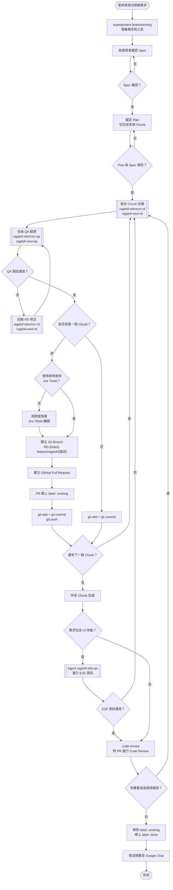

# Ragdoll AI Agent 開發工作流程

## 流程概覽（Mermaid 視覺化）



---

## 環境前置檢查（每次開始工作前必做）

在進行任何 git / gh 操作前，必須先確認以下工具可用：

```bash
source ~/.bashrc
git --version
gh --version
```

- 若 `git` 不可用：請使用者安裝 [Git for Windows](https://git-scm.com/download/win) 並重新開啟終端機後再繼續。
- 若 `gh` 不可用：請使用者安裝 [GitHub CLI](https://cli.github.com/) 並執行 `gh auth login` 完成身分驗證後再繼續。

**工具未就緒時，不要嘗試自行修復 PATH 或繞過問題，直接告知使用者完成安裝與驗證後再回來。**

### husky pre-commit hook 失敗時的處理

若執行 `git commit` 時出現 `_/husky.sh: No such file or directory` 錯誤，執行：

```bash
cd .. && npx husky install
```

然後重新 commit。

---

## 詳細流程說明

### Step 1 — 接收需求，呼叫 `superpowers:brainstorming`

當使用者提出規格開發需求時，**必須先呼叫 SKILL `superpowers:brainstorming`** 來蒐集相關工具與上下文，再進入後續流程。

---

### Step 2 — 與使用者確認 Spec

- 整理使用者需求，輸出清楚的功能規格（Spec）。
- 與使用者反覆確認，直到雙方對 Spec 內容達成共識。

---

### Step 3 — 擬定 Plan 並切分 Chunk

- 根據確認好的 Spec 擬定實作計畫（Plan）。
- Plan 必須切分為多個 **Chunk**（子任務），每個 Chunk 對應可獨立提交的工作單元。
- 確認 Plan 的每個 Chunk 均能對應到 Spec 的功能需求，確保沒有遺漏。

---

### Step 4 — 發派 Chunk 任務給 Subagent

依照 Chunk 的內容，將任務分派給對應的 subagent：

| Subagent | 負責範圍 |
|---|---|
| `ragdoll-workflow:ragdoll-electron-rd` | Electron 層：SQLite、IPC、背景排程、Node.js 後端邏輯 |
| `ragdoll-workflow:ragdoll-next-rd` | Next.js 層：前端 UI、資料層、Store 串接 |

> 若 Chunk 同時涉及兩層，兩個 subagent 可並行發派。

---

### Step 5 — 交由 QA Subagent 進行測試驗證

當 `ragdoll-workflow:ragdoll-electron-rd` 或 `ragdoll-workflow:ragdoll-next-rd` 完成 Chunk 實作後，**必須**將實作結果交由對應的 QA subagent 進行測試：

| RD Subagent | 對應 QA Subagent |
|---|---|
| `ragdoll-workflow:ragdoll-electron-rd` | `ragdoll-workflow:ragdoll-electron-qa` |
| `ragdoll-workflow:ragdoll-next-rd` | `ragdoll-workflow:ragdoll-next-qa` |

> 若 Chunk 同時涉及兩層，兩個 QA subagent 可並行發派。

**測試未通過時的處理流程：**

1. QA subagent 回報測試失敗的詳細錯誤訊息與失敗原因。
2. 將錯誤資訊轉交給對應的 RD subagent 進行修正。
3. RD subagent 修正完成後，再次交由 QA subagent 驗證。
4. **重複上述步驟，直到 QA 測試全部通過為止。**

測試通過後，才能進入下一步的 Git Commit。

---

### Step 6 — 每個 Chunk 完成後進行 Git Commit

每當 subagent 完成一個 Chunk 的實作，立即執行：

```bash
git add <相關檔案>
git commit -m "<清楚描述此 Chunk 的變更>"
```

---

### Step 7 — 執行 `wonderpet-general:github-pull-request-steps`

呼叫 **`wonderpet-general:github-pull-request-steps`** 技能，並帶入以下 Ragdoll 專案參數：

| 參數 | Ragdoll 專案的值 |
|---|---|
| 分支命名規則 | `RD-{jira-ticket}-feature/ragdoll/{30字以內的描述}` |
| PR 標題格式 | `[Ragdoll][RD-{jira-ticket}] {簡短描述}` |
| E2E QA Subagent | `ragdoll-workflow:ragdoll-e2e-qa`，需遵照 `ragdoll-workflow:ragdoll-e2e-workflow` 完整流程（含讀取 `ragdoll-knowledge-base:ragdoll-checkout-flow`、`playwright-best-practices`，並至 `test-results/` 診斷失敗原因） |
| Code Review 失敗時回報對象 | `ragdoll-workflow:ragdoll-electron-rd`、`ragdoll-workflow:ragdoll-next-rd` |
| Google Chat 摘要標題 | `【Ragdoll 開發摘要】` |

---

## Subagent 對照表

| Subagent | 角色 | 技術範疇 |
|---|---|---|
| `ragdoll-workflow:ragdoll-electron-rd` | Electron 開發 | SQLite、IPC、Node.js 後端 |
| `ragdoll-workflow:ragdoll-next-rd` | Next.js 開發 | 前端 UI、Store、API 串接 |
| `ragdoll-workflow:ragdoll-e2e-qa` | E2E 測試 | Playwright、結帳流程測試 |
| `ragdoll-workflow:ragdoll-electron-qa` | Electron 測試 | Electron 層功能驗證 |
| `ragdoll-workflow:ragdoll-next-qa` | Next.js 測試 | Next.js 層功能驗證 |

---

## 分支命名規則

```
RD-{jira-ticket}-feature/ragdoll/{30個字以內的描述}
```

- `{jira-ticket}`: Jira Ticket 編號（若使用者未提供，必須詢問）
- `{描述}`: 以連字號分隔的英文短描述，30 字以內

**範例：**
- `RD-6857-feature/ragdoll/checkout-e2e-testing`
- `RD-1234-feature/ragdoll/discount-calculator-fix`
